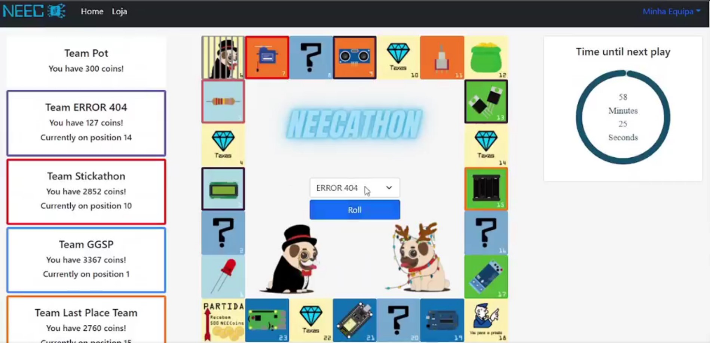

<br/>
<p align="center">
  <a href="https://github.com/NEECIST/NEECathon-website">
    
  </a>

  <h3 align="center">NEECathon 2021 - Monopoly</h3>

  <p align="center">
    💰 Own it all! 💰
    <br/>
    <br/>
  </p>
</p>

    

## Table Of Contents

* [About the Project](#about-the-project)
* [Built With](#built-with)
* [Getting Started](#getting-started)
  * [Prerequisites](#prerequisites)
  * [Installation](#installation)
* [Usage](#usage)
* [Authors](#authors)

## About The Project



Este repositório contem todo o código de front-end utilizado na NEECathon no ano de 2021. 

O sub-tema da competição neste ano era o jogo do Monopólio, tendo por isso um tabuleiro feito a medida da competição, repleto de componentes eletrónicos em vez das clássicas ruas e avenidas.

Além de servir como tabuleiro de jogo, este website contêm tambem a nossa loja digital com todos os componentes que as várias equipas podiam comprar e usar nos seus projectos.


## Built With


* [React.JS v17.0.2](https://react.dev/)
* [react-bootstrap](https://react-bootstrap.github.io/)
* [Supabase (v1)](https://supabase.com/)

## Getting Started

Coisas a fazer para por o site a correr!

### Prerequisites

* npm

```sh
npm install npm@latest -g
```

### Installation

1. Clonar o repositório

```sh
git clone https://github.com/your_username_/Project-Name.git
```

2. Install NPM packages

```sh
npm install
```

3. Alterar as configurações da base de dados do supabase `supabaseClient.js`

```JS
const supabaseUrl = SUPABSE_URL;
const supabaseSecretKey = SUPABASE_PUBLIC_KEY;
```

## Usage

Para dar deploy seguir os passos da [`Installation`](#installation), procedendo de seguida ao build do site através do comando:
```sh
npm build
```
Para alem deste passo é necessário também configurar o Apache, apontando as configurações para o link do localhost, com a porta correta.

Esta configuração é feita através do ficheiro que se encontra no servidor do NEEC em `/etc/apache2/sites-available/` após a configuração colocar o site a correr com o comando ``` a2ensite NOME_DO_FICHEIRO_DO_SITE``` e de seguida entrar na pasta build do site e correr o comando `serve`. 


### Creating A Pull Request


## Authors

* **Vasco Rodrigues** - *Coordenador de Equipa* - [Vasco Rodrigues](https://github.com/VascoDVRodrigues) - *Desenvolvimento de Routes, CSS e funcionalidades*
* **Gonçalo Midões** - *Colaborador* - [Gonçalo Midões](Midas-sudo) - *Desenvolvimento de CSS e funcionalidades*
* **André Silva** - *Colaborador* - [André Silva](https://github.com/Andreps18) - *Desenvolvimento de funcionalidades*
* **André Pereira** - *Colaborador* - [André Pereira](https://github.com/Andre-MR-Pereira) - *Desenvolvimento de funcionalidades*
* **Gonçalo Coelho** - *Colaborador* - [Gonçalo Coelho](https://github.com/goncoelho) - *Desenvolvimento de funcionalidades*

